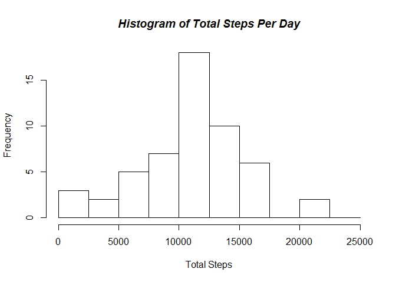
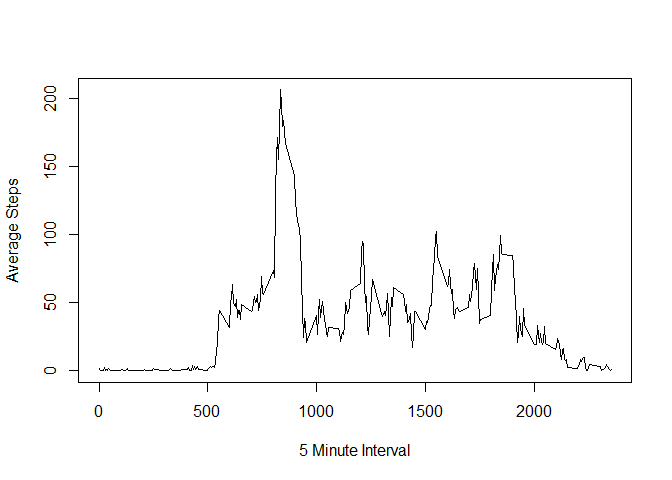
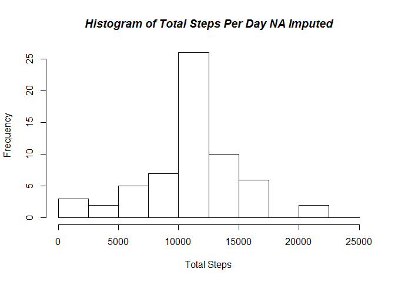
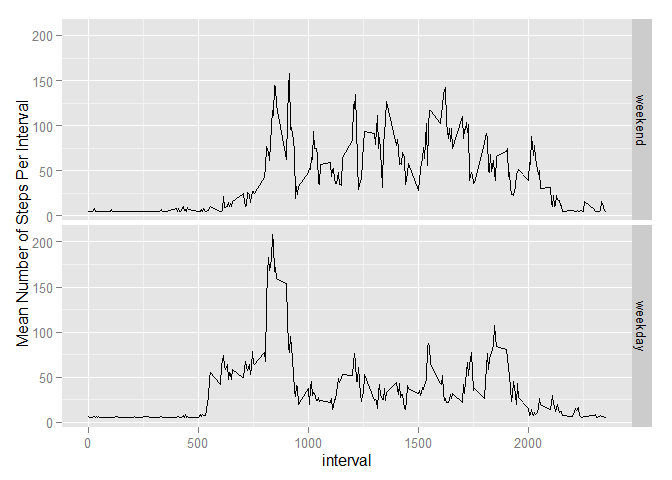

# Reproducible Research: Peer Assessment 1
## Loading and preprocessing the data


```r
# use http: instead of https:
download.file(url = "http://d396qusza40orc.cloudfront.net/repdata%2Fdata%2Factivity.zip", destfile = "activity.zip", method = "auto")
unzip("activity.zip")
data <- read.csv("activity.csv")
data$date <- as.POSIXct(data$date)
```

## What is the mean total number of steps taken per day?


```r
library(dplyr)
library(ggplot2)
library(lubridate)
```


```r
no_NA <- filter(data, steps != "NA") # data_no_NA <- data[complete.cases(data),]

by_date <- group_by(no_NA, date)

total_steps <- summarise(by_date, total.steps = sum(steps))

bin_steps <- seq(from = 0, to = 25000, by = 2500)

hist(total_steps$total.steps, breaks = bin_steps,
     main = paste("Histogram of Total Steps Per Day"),
     xlab = "Total Steps")
```

 

```r
mean(total_steps$total.steps)
```

```
## [1] 10766.19
```

```r
median(total_steps$total.steps)
```

```
## [1] 10765
```

## What is the average daily activity pattern?


```r
interval <- group_by(no_NA, interval)

interval_avg <- summarise(interval, avg.steps = mean(steps))

plot(interval_avg$interval, interval_avg$avg.steps, type="l",
     xlab = "5 Minute Interval",
     ylab = "Average Steps")
```

 

```r
max_steps <- filter(interval_avg, avg.steps == max(avg.steps))

max_steps # The interval with the maximum average steps per day.
```

```
## Source: local data frame [1 x 2]
## 
##   interval avg.steps
## 1      835  206.1698
```

## Imputing missing values


```r
nrow(data) - nrow(no_NA) # Number of NAs.
```

```
## [1] 2304
```

```r
mean_steps <- summarise(by_date, avg.steps = mean(steps))

avg_day <- mean(mean_steps$avg.steps) # used to replace NA's that span entire days.

joined <- left_join(data, mean_steps, by = "date")

# Loop to replace NA's with the the overall mean if all values from the day are
# missing and to replace the values for the interval if not all of the day's values
# are missing.

for (i in 1:nrow(joined)) {
      if(is.na(joined$steps[i]) & is.na(joined$avg.steps[i])) { 
            joined$steps[i] <- avg_day
      } else { 
            if(is.na(joined$steps[i])) {
                  joined$steps[i] <- joined$avg.steps[i]
            }
       else  joined$steps[i] <- joined$steps[i]
      }
}

# joined2 <- mutate(joined, steps2 = ifelse(is.na(steps) & is.na(avg.steps), avg_day, steps))

grp2 <- group_by(joined, date)

total_steps2 <- summarise(grp2, total.steps = sum(steps))

bin_steps <- seq(from = 0, to = 25000, by = 2500)

hist(total_steps2$total.steps, breaks = bin_steps,
     main = paste("Histogram of Total Steps Per Day NA Imputed"),
     xlab = "Total Steps")
```

 

```r
mean(total_steps2$total.steps)
```

```
## [1] 10766.19
```

```r
median(total_steps2$total.steps)
```

```
## [1] 10766.19
```
The mean values don't differ because the NA values were for periods of a whole day and the mean for a day was substituted for the NA value.  

The median value changes slightly because now there are fractional numbers introduced into the new data set.

The frequency of total steps near the mean  of the distribution increased.


## Are there differences in activity patterns between weekdays and weekends?


```r
dayofweek <- mutate(joined, dayofweek = wday(date))

week <- mutate(dayofweek, weekend = ifelse(dayofweek == 1 | dayofweek == 7, 1, 2))

week <- mutate(week, weekend2 = factor(weekend, labels = c("weekend", "weekday")))

grp3 <- group_by(week, weekend2, interval)

sum4 <- summarise(grp3, interval.avg = mean(steps))

p <- ggplot(sum4, aes(interval, interval.avg))
p <- p + geom_line()
p <- p + facet_grid(weekend2~.)
p <- p + ylab("Mean Number of Steps Per Interval")
p
```

 
